In this project, we study the attributes of storms in East Pacific and North Atlantic basins.

In terms of data source, we use the database [International Best Track Archive for Climate Stewardship (IBTrACS)](https://www.ncdc.noaa.gov/ibtracs/index.php?name=wmo-data).

## Part 1: North Atlantic Storms

As the first part of the project, we focus on storms in the North Atlantic basin. From the [IBTrACS Database](https://www.ncdc.noaa.gov/ibtracs/index.php?name=wmo-data), we use the [HURDAT file of storms in North Atlantic basin](ftp://eclipse.ncdc.noaa.gov/pub/ibtracs/v03r06/wmo/hurdat_format/basin/Basin.NA.ibtracs_hurdat.v03r06.hdat).

After cleaning up the raw data, we obtain two clean datasets [storms.csv](../data/storms.csv) - which record ID, start date, number of days with available position, and name for each storm - and [tracks.csv](../data/tracks.csv) - which record stage, latitude (N), longitude (E), wind speed, and surface pressure for each period of each day of each storm.

With the cleaned data, we conduct the following four analyses.

### 1.1 Analysis per Year

First, we obtain frequency table and barplot for number of storms per year.

```{r, echo=FALSE}
print("Number of Storms per Year")
load("../data/storms_per_year.Rda")
t(temp_table)
```
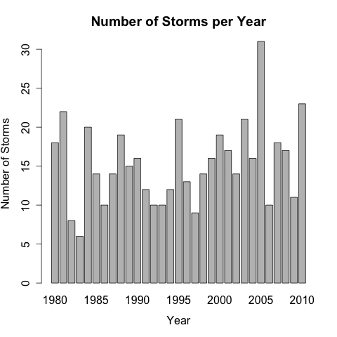

We can subset the storms by maximum wind speeds and reproduce the frequency table and barplot above for each subset.

```{r, echo=FALSE}
print("Number of Storms per Year with Winds >= 35 Knots")
load("../data/storms_per_year_35.Rda")
t(temp_table)
```
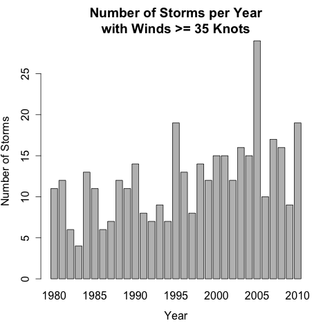

```{r, echo=FALSE}
print("Number of Storms per Year with Winds >= 64 Knots")
load("../data/storms_per_year_64.Rda")
t(temp_table)
```
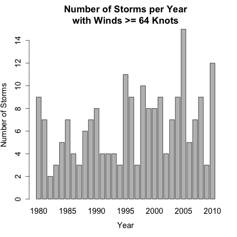

```{r, echo=FALSE}
print("Number of Storms per Year with Winds >= 96 Knots")
load("../data/storms_per_year_96.Rda")
t(temp_table)
```
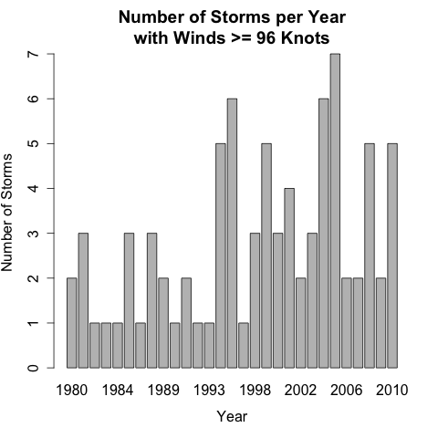

### 1.2 Analysis per Month

Next, we obtain frequency tables and barplots for number of storms per month. Here we simply counts the number of unique storms in a particular month. Note that since a storm can span several months, the total number of storms aggregated over months should be greater than the total number of unique storms.

```{r, echo=FALSE}
print("Number of Storms per Month")
load("../data/storms_per_month.Rda")
t(temp_table)
```
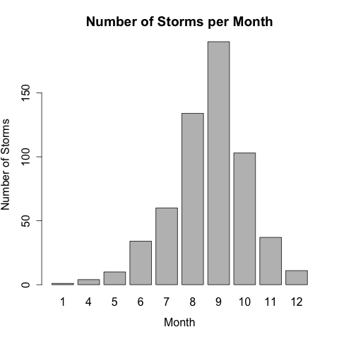

Similarly, we can subset the storms by their maximum wind speeds in that particular month and reproduce the frequency table and barplot above for each subset.

```{r, echo=FALSE}
print("Number of Storms per Month with Winds >= 35 Knots")
load("../data/storms_per_month_35.Rda")
t(temp_table)
```
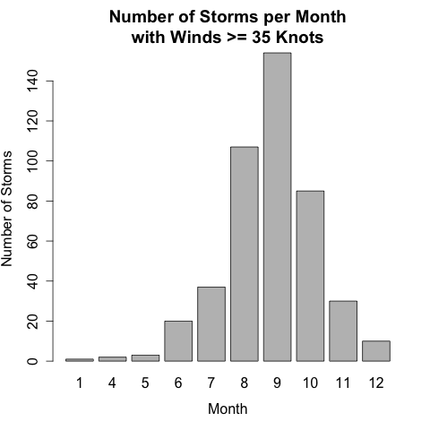

```{r, echo=FALSE}
print("Number of Storms per Month with Winds >= 64 Knots")
load("../data/storms_per_month_64.Rda")
t(temp_table)
```
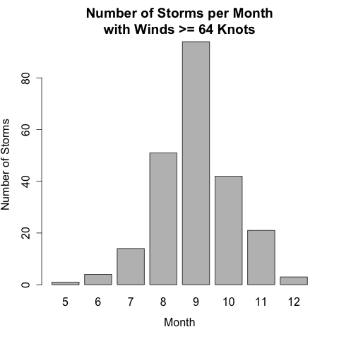

```{r, echo=FALSE}
print("Number of Storms per Month with Winds >= 96 Knots")
load("../data/storms_per_month_96.Rda")
t(temp_table)
```
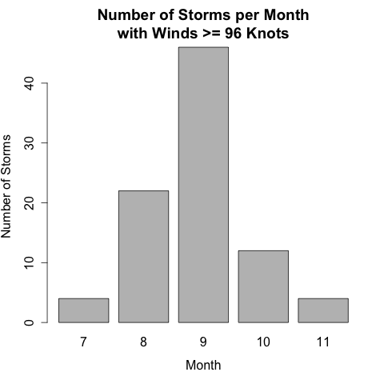

From the graphs we can see that not only does Autumn (August, September and October) have more storms, they also have more particularly strong storms.

### 1.3 Annual Avg Number of Storms

As our third analysis, we compute a set of statistics (mean, standard deviation, first quantile, median, and third quantile) for the number of storms with maximum wind speeds of at least 35, 64, and 96 Knots respectively. The results are shown below.

```{r, echo=FALSE}
print("Annual Avg Number of Storms")
load("../data/annual_avg.Rda")
temp_table
```

### 1.4 Regression Analysis

As our last analysis for Part 1, we look at the regression between surface pressure and wind speed. For each storm, we compute the mean of its surface pressure and wind speed and run regressions between the two variables. The graph below shows a scatter plot of the two variables with the regression line highlighted in red.

After some exploration, we found that taking out storms with mean surface pressure at 0 and treating 0 surface pressure as NA yield much more significant result, and hence adopted as our assumption.

The graph below shows that higher mean wind speed is associated with lower mean surface pressure.

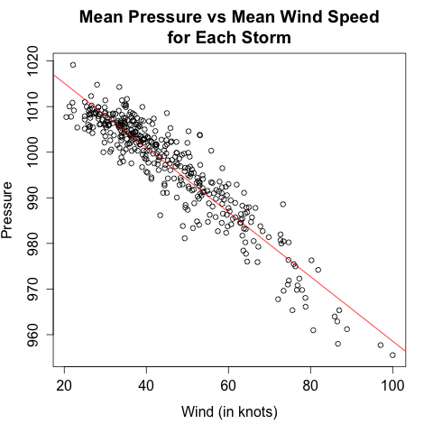

As a robustness check, we reproduce the analysis with the median of surface pressure and wind speed for each storm. As shown in the graph below, the result is consistent in that higher wind speed is associated with lower surface pressure.

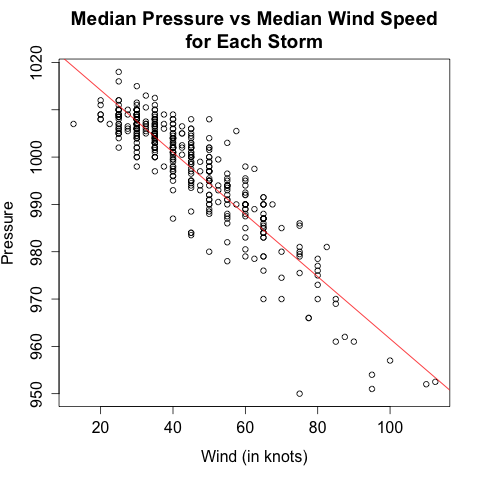

## Part 2: East Pacific and North Atlantic Storms

Part 2 of the project considers storms in both East Pacific and North Atlantic basins and focuses on the trajectories of the storms. We use the [CSV files](ftp://eclipse.ncdc.noaa.gov/pub/ibtracs/v03r06/wmo/csv/basin) from [IBTrACS Database](https://www.ncdc.noaa.gov/ibtracs/index.php?name=wmo-data) for this part of the analysis.

After cleaning up the data, we can produce on a map of the trajectory for each storm from the series of longitudes and latitudes.

We restrict our map view to around the North America Continent, where location reference is easy to interpret. Therefore, the limits for the longitude and latitude of the map are W130 to W30, and N5 to N55.

For each trajectory we color its different parts by the associated wind speed.

The following graphs are trajectories of storms corresponding to different attributes.

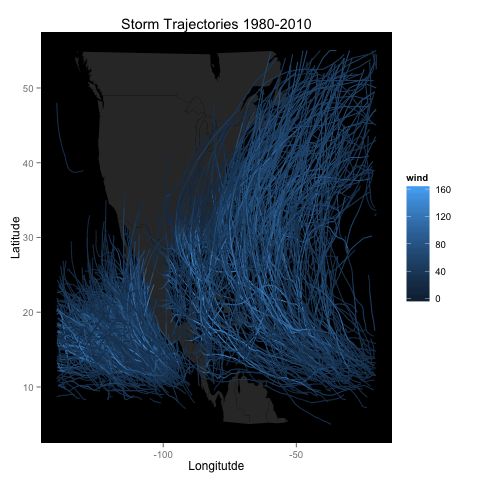
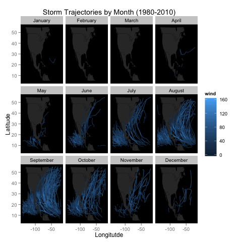
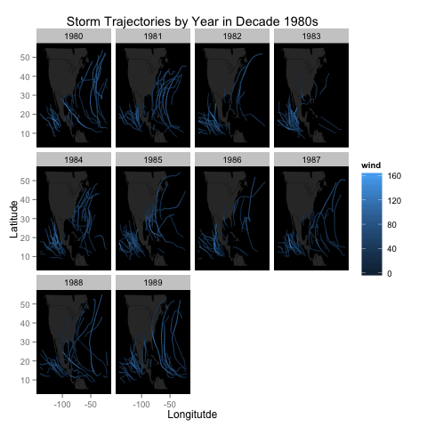
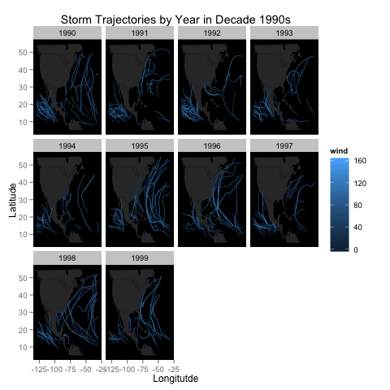
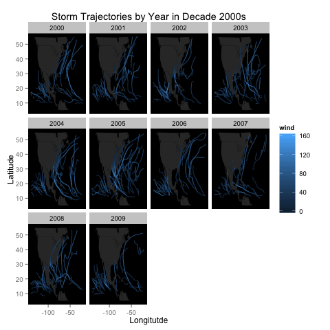

As we can see from the graphs, trajectories of storms in the North Atlantic basin follow a general pattern of curving in towards the continent. In addition, the intensity of a storm (indicated by its wind speed) generally goes up as the storm move towards the continent and subsides as it moves away.